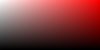
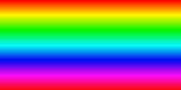

# My Lua Image Experiments

Some image related experiments for use with MWSE. To use drop the file from this repo's `MWSE` directory into your `MWSE` directory. You will need livecoding installed. For rapid prototyping just do `Alt + x` on the main menu and preview the changes instantly. Then close the menu using `f` key. Then you can do additional changes and preview them by restarting livecoding.

## Example

```lua
local Image = require("Image")

local img1 = Image:new({
	width = 200,
	height = 100,
})

img1:horizontalColorGradient({ r = 255, g = 0, b = 0 })
img1:saveBMP("img1.bmp")

local img2 = Image:new({
	width = 200,
	height = 100,
})
img2:verticalGrayGradient()
img2:saveBMP("img2.bmp")


local blended = img2:blend(img1, 0.5, "plus")
blended:saveBMP("img1+img2.bmp")

local hueBar = Image:new({
	width = 200,
	height = 100,
})
hueBar:verticalHueBar()
hueBar:saveBMP("imgHueBar.bmp")

local alphaBar = Image:new({
	width = 200,
	height = 100,
})
alphaBar:verticalGradient({ r = 0, g = 0, b = 0 }, { r = 255, g = 255, b = 255 })
alphaBar:saveBMP("imgAlphaBar.bmp")

```
### Results:

img1.bmp:


img2.bmp (note, alpha was lost when saving to bmp)


img1+img2.bmp - could be used for a color picker



imgHueBar



imgAlphaBar

